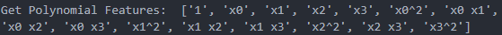
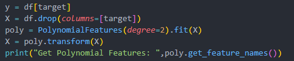

# PolynomialFeatures
Polynomial Feature Extraction

Generate a new feature matrix consisting of all polynomial combinations of the features with degree less than or equal to the specified degree. 
For example, if an input sample is two dimensional and of the form [a, b], the degree-2 polynomial features are;
[1, a, b, a^2, ab, b^2].

# Get Polynomial Feature with 2nd Degree.

# Code for 2nd Degree Polynomial Features
    If you would like to have more polynomial degree you can easily change the parameter of
    (degree=2).

